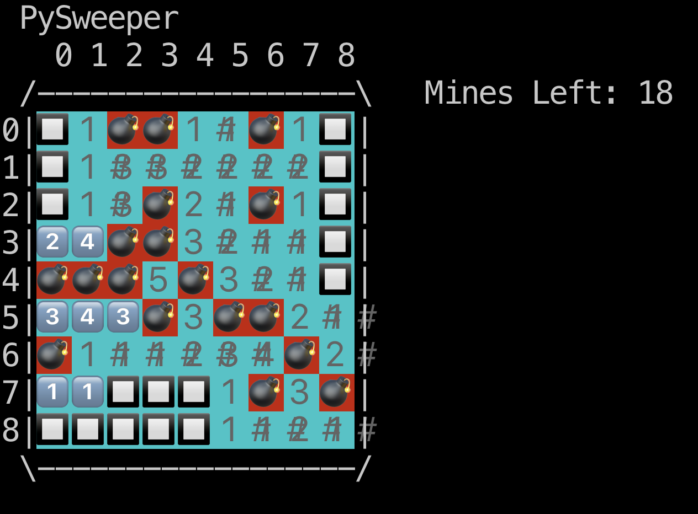

PySweeper!!!
============

That's right... a python implementation of MineSweeper ...
 ... using emoji on the command-line!
 ... or using Tk!

It's my first "serious" Python project (and it probably shows)

Requirements
============
1. a terminal
2. python 3.9 or 3.10
3. Python's colorama and emoji modules

Playing the game
================
$ python game.py --rows ?? --cols ?? --mines ??

Make it as hard or as easy as you want with the following limitations:
- There MUST be at least 1 cell in the board that does not contain a mine
- The board is limited to (at most) slightly smaller than your terminal window... or 36 rows and columns... which ever is smaller

IMPORTANT NOTES
===============

Terminal settings
-----------------
Make sure your terminal (for playing the CLI implementation) is using a monospace font.

Terminal vs iTerm (MacOS)
-------------------------
When I first implemented this and recorded the [demo video](#demo-video), iTerm was properly displaying keycap emoji. However, as the beginning of June 2022 (my) iTerm started displaying keycaps _after_ extended Unicode characters ( such as \U0001F4A3 5\UFE0F\U20E3 inconsistently ):

For best results, use the Terminal.app in MacOS

Demo Video
==========
[Demo video](https://youtu.be/r56bWaF3K6E)
